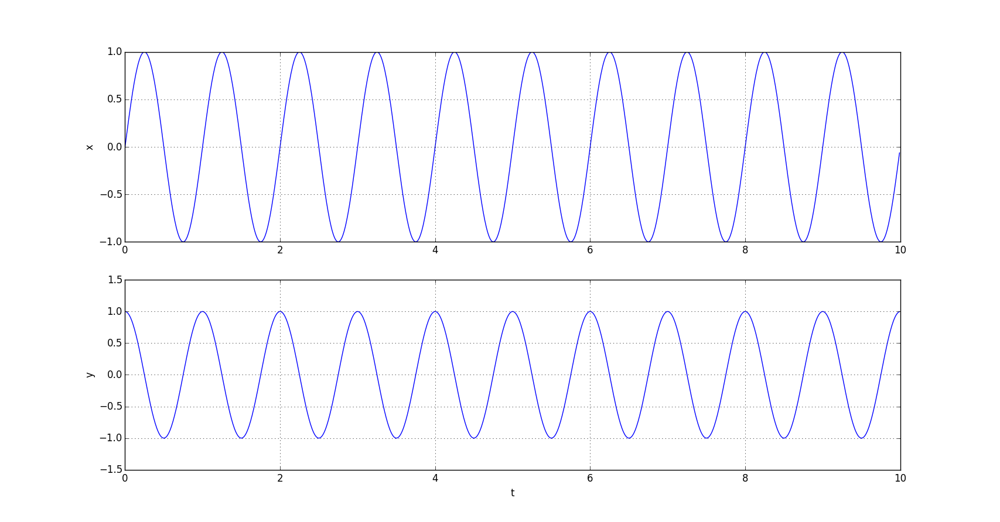
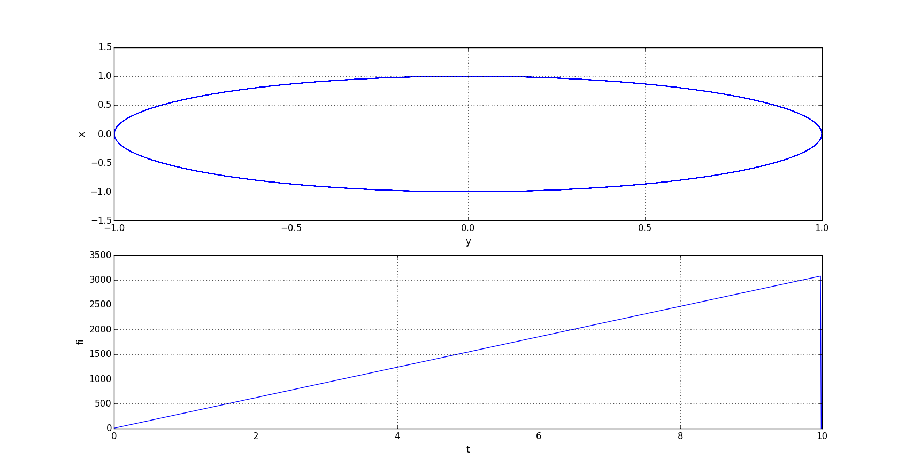

# Analysis of Phase

## Description

We have two signals - sin and cos

## Motivation

I don't know why teachers spent so little time for learning about phase at schools and university. 
If you don't believe me ask yourself what's phase?
I want to tell you one thing. 
Phase is like I.D. of signals. It contained a lot of information you need. 

## Results

Analysis of phase shows linear character

## Learn more

- [Wiki Phase](https://en.wikipedia.org/wiki/Phase_(waves))

## Installation

You can use [Python](https://www.python.org/) with data package: [Anaconda](https://www.anaconda.com/) or [Miniconda](https://conda.io/miniconda).
There's another way - use [Portable Python](http://portablepython.com/). Also you can use whatever IDE for Python.

## License

Free